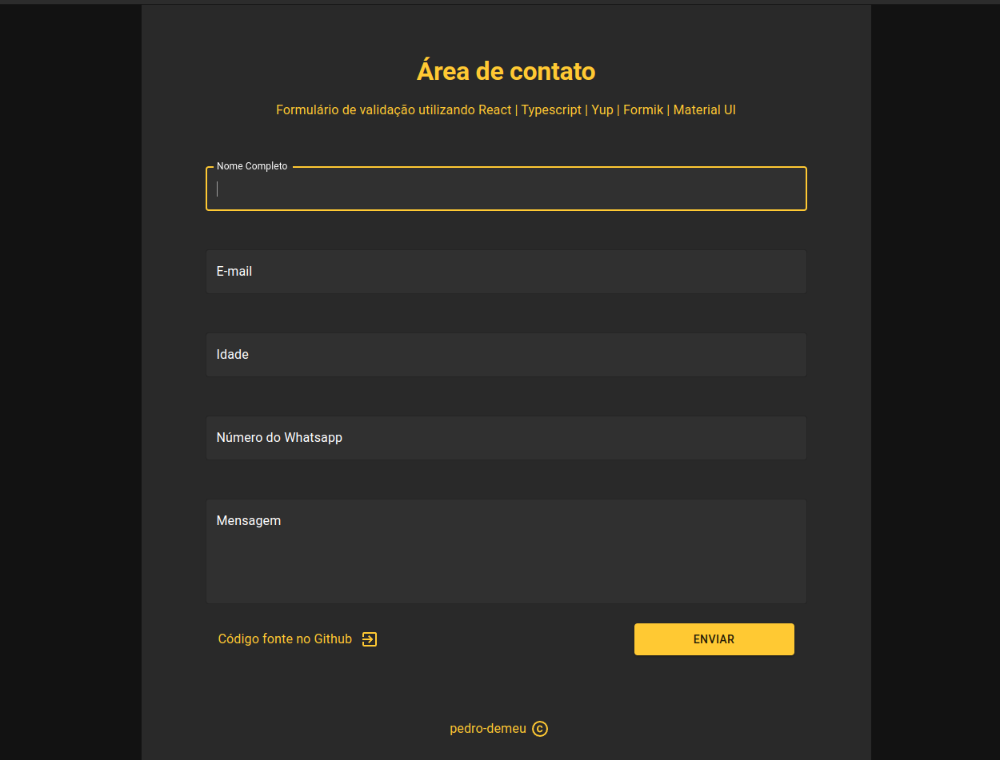
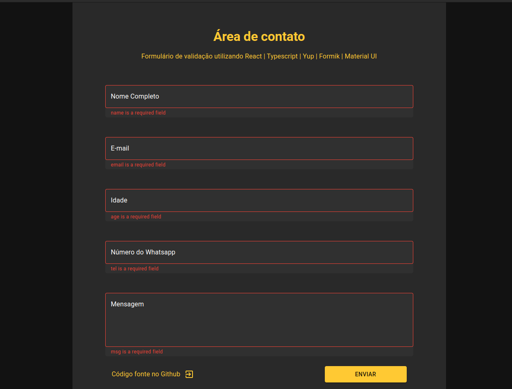
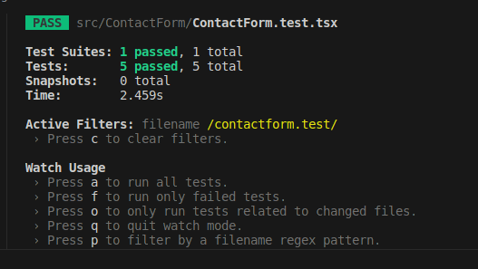

# Validações de formulário

### Imagem da Aplicação:

  

   
### Imagem da aplicação com erros:

  

## Como rodar a aplicação:

### `yarn install` -> Instalar dependências

### `yarn start` -> Inicia aplicação em localhost:3000

### `yarn test` -> Inicia os testes do projeto

### `yarn build` -> Builda aplicação

### `docker build -t form-validations:form-validations .` -> Constrói imagem docker do projeto

### `docker run -it -v ${PWD}:/app -v /app/node_modules -p 3001:3000 --rm form-validations:form-validations` -> Executa imagem gerada com docker

  
## Imagem dos Testes:

  

